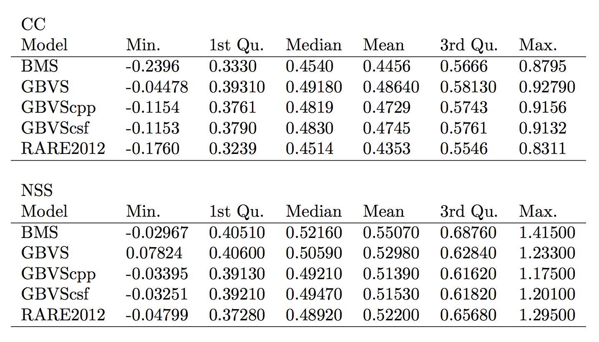

# Graph-Based Visual Saliency (GBVS) 

Implementation of the Graph-Based Visual Saliency (GBVS) from the paper:  
J. Harel, C. Koch, and P. Perona, "Graph-Based Visual Saliency", Proceedings of Neural Information Processing Systems (NIPS), 2006

The MATLAB code of the author can be found at the following URL:
http://www.vision.caltech.edu/%7Eharel/share/gbvs.php

# About this code

The proposed implementation in C++ of GBVS was written by Pierre Lebreton. It was done by transposing the original MATLAB code to C++ using OpenCV. Special care should then be taken about it as it may involve intellectual properties from the California Institute of Technology and the respective authors of GBVS. 

# Analysis of the proposed implementation

One of the outcomes of the project has been the re-implementation of the Graph-Based Visual Saliency (GBVS) [1] in C++ with OpenCV. The motivation behind this task was to allow integrating the GBVS method within a more complex framework without the requirement of having a MATLAB license. To do such a task, the MATLAB code was closely translated to C++ and OpenCV. In its current state, most of the original features of GBVS have been reimplemented. This includes the standard configuration, but also include further extensions such as the multi-scale interaction between features. \\
The only NOT implemented features relates to the motion-based features: the flicker and motion features. This corresponds to the channels ``F`` and ``M``. In addition, it should be stated that in the current implementation the channel ``F`` is replaced by a high-level feature: face detection using Viola and Jones Haar cascade detector. 

## Performance 

In order to illustrate the performance of the proposed implementation compared to the original MATLAB code, the algorithm was tested on the database CAT2000 released by the MIT. This database was meant for the evaluation of computational saliency models [2]. It contains 2000 images with a large variety of content: natural images, fractals, black and white images, emotional images, ... The Figure below shows the performance of the proposed implementation compared to the original implementation in MATLAB and two other baselines: the Boolean Saliency MAP (BMS) [3] and RARE2012 [4]. Additionally, one extension to GBVS is proposed, named GBVS CSF. This extension uses the luminance component of the CIELuv color space  instead of using a luminance component based on the maximum value of R, G and B as performed in the reference implementation. And on which a contrast sensitivity function is applied [6]. 

On this database it appears that the C++ implementation of GBVS performs in overall similarly to the original MATLAB implementation. However, a strict performance analysis reveals that the original MATLAB implementation perform slightly better than the C++ - based implementation. And the C++ implementation using the CSF performs better than the C++ implementation following strictly the original implementation. The original MATLAB code is always better than the other approaches. Therefore, if performance comparison between saliency model is targeted, the original MATLAB code should rather be used compared to this implementation of GBVS. 

As a final comment on performance, it should be noted that the performance of RARE2012 and BMS are indicative. The results of both BMS and RARE2012 were obtained from using the code released of their respective author. Default parameters were used, and the performance evaluation of each model (including GBVS and its different instantiations) was not performed after having re-blurred the final estimated saliency map by an optimal Gaussian blur. The goal of this study was rather to evaluate the consistency of the results between GBVS from the MATLAB code and this implementation in C++, than comparing models in general.   

## Identification of source of differences 

An in-depth analysis of the code to identify the differences between the MATLAB and C++ implementation have been performed. The key difference between the implementations lies in the ``resize`` functions used to downscale feature maps and at the end of the process upscale the final master saliency map. Indeed, the MATLAB implementation uses a bicubic interpolation to perform both down sampling and upscaling process. However, in OpenCV a different implementation of the bicubic interpolation was found. Using this different implementation, ringing artefacts in the feature maps are observed. Therefore, as recommended in the documentation, for down sampling an interpolation type ``CV::INTER\_AREA``  is used as better suited for large downsampling. Similarly, a lanczos3 (cv::INTER_LANCZOS4) interpolation is performed for upscaling the final master map to obtain the final saliency map instead of the bicubic interpolation. \\

The second source of deviation observed in the code lies in the function ``GBVS::principalEigenvectorRaw`` which compute the eigen vector of the Markovian matrix. The MATLAB implementation uses sparse matrix to simplify the computation process. This is not implemented in the C++ version, and therefore it was observed that the C++ implementation requires a finer termination criteria (``tol``) compared to the MATLAB code. 

These are the two main sources of differences currently identified in the code. 

## References

[1] Jonathan Harel, Christof Koch, and Pietro Perona, "Graph-Based Vi- sual Saliency," in Proceedings of Neural Information Processing Systems (NIPS), 2006.
[2] Zoya Bylinskii, Tilke Judd, Ali Borji, Laurent Itti, Fr ́edo Durand, Aude Oliva, and Antonio Torralba, "Mit saliency benchmark" .
[3] Jianming Zhang and Stan Sclaroff, "Saliency detection: A boolean map approach," in IEEE International Conference on Computer Vision (ICCV), 2013.
[4] Nicolas Riche, Matei Mancas, Matthieu Duvinage, Makiese Mibulumukini, Bernard Gosselin, and Thierry Dutoit, "Rare2012: A multi-scale rarity- based saliency detection with its comparative statistical analysis," Signal Processing: Image Communication, vol. 28, no. 6, pp. 642 – 658, 2013.
[5] P. Viola and M. Jones, "Robust real-time object detection," in Interna- tional Journal of Computer Vision, 2001.
[6] Scott Daly, "The visible differences predictor: An algorithm for the as- sessment of image fidelity.," Digital Image and Human Vision, Cambridge, MA: MIT Press, A. Watson, Ed., pp. 179–206, 1993.

# License 

Copyright (C) 2017 

This program is free software: you can redistribute it and/or modify
it under the terms of the GNU General Public License as published by
the Free Software Foundation, either version 3 of the License, or
(at your option) any later version.

This program is distributed in the hope that it will be useful,
but WITHOUT ANY WARRANTY; without even the implied warranty of
MERCHANTABILITY or FITNESS FOR A PARTICULAR PURPOSE.  See the
GNU General Public License for more details.

You should have received a copy of the GNU General Public License
along with this program.  If not, see <http://www.gnu.org/licenses/>.
If you have problems about this software, please contact: 